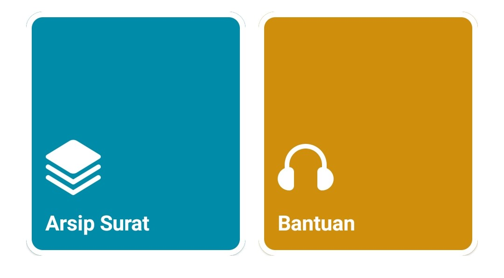
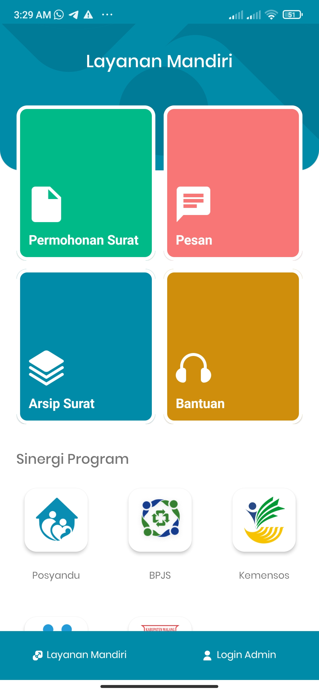

# VerticalIconButton

[](https://jitpack.io/#ilhamhadisyah/VerticalIconButton)
[](https://github.com/ilhamhadisyah/VerticalIconButton/issues)
[]()
[]()



Beautiful ui sometime need extreme layout. This library provide some various custom button with easy way for developers to design their app.
This button inspired by dribbble inspiration that people have made some UI design like that, I try to implement it.

# Preview



there always have left bottom alignment, but you still can modify those model and color.

## Features

- **Make your app more beautiful:** with touch effect and unique layout
- **Support color changing:** can easily do even change the icon background
- **Various height:** you can set the margin of the icon so you can easily construct your button only in one way
- **RelativeLayout support:** will make you easier to implement it in any layout


### Getting Started

##### Gradle.setting
```gradle
dependencyResolutionManagement {
    ...
    repositories {
        ...
        maven { url 'https://jitpack.io' }
    }
}
```

Always use the latest release version
```gradle
dependencies {
    ...
    implementation 'com.github.ilhamhadisyah:VerticalIconButton:release_version'
}
```

##### XML
```xml
<com.hadisyah.verticaliconbutton.VerticalIconBoxedButton
            android:layout_width="match_parent"
            android:layout_height="wrap_content"
            android:layout_margin="5dp"
            android:layout_weight="1"
            app:button_text="This is an example"
            app:icon="@mipmap/ic_launcher"
            app:icon_weight="90" />
```

### Configuration

Property | Type | Description
--- | --- | ---
button_text | string | Set text in the button
icon | reference | Use drawable image or xml
button_background_color_normal | color | Coloring the button body (default #1E88E5)
icon_background_color | color | Coloring the icon background (default #1E88E5)
stroke_width | integer | Add stroke width (default is 0)
stroke_color | color | Coloring the icon background (default color.WHITE)
button_text_color | color | Coloring the text (default color.WHITE)
button_text_size | dimension | Set text size (default 12.0f)
icon_weight | integer | Set scale of the icon (default 150)
icon_margin_top | dimension | set icon margin top (default 0)


### Third-party licenses

This software uses following technologies with great appreciation:

* [AndroidX](https://developer.android.com/jetpack/androidx)
* [gradle-maven-publish-plugin](https://github.com/vanniktech/gradle-maven-publish-plugin)
* [Material Components for Android](https://material.io/components)

### License

Copyright 2022 Ilham Hadisyah

[](https://github.com/ilhamhadisyah/VerticalIconButton/blob/master/LICENSE)

Licensed under the Apache License, Version 2.0 (the "License");
you may not use this file except in compliance with the License.
You may obtain a copy of the License at

    http://www.apache.org/licenses/LICENSE-2.0

Unless required by applicable law or agreed to in writing, software
distributed under the License is distributed on an "AS IS" BASIS,
WITHOUT WARRANTIES OR CONDITIONS OF ANY KIND, either express or implied.
See the License for the specific language governing permissions and
limitations under the License.
